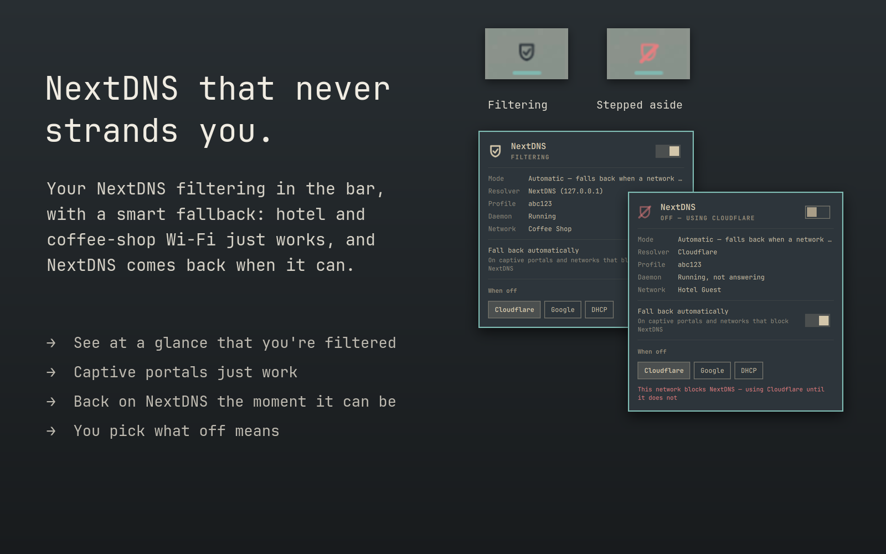
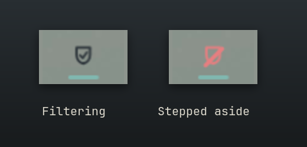
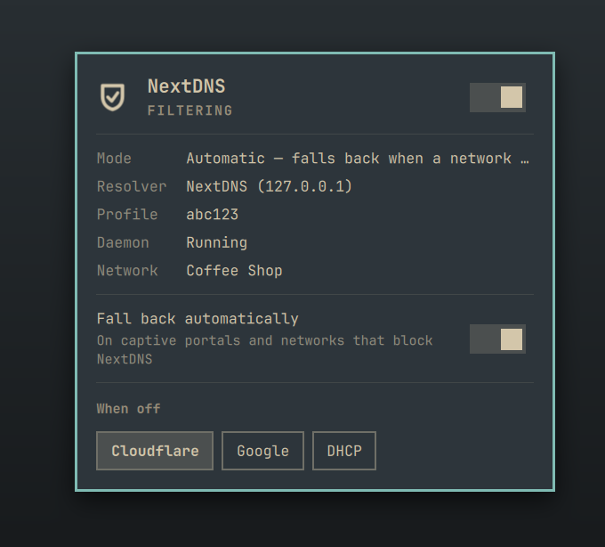
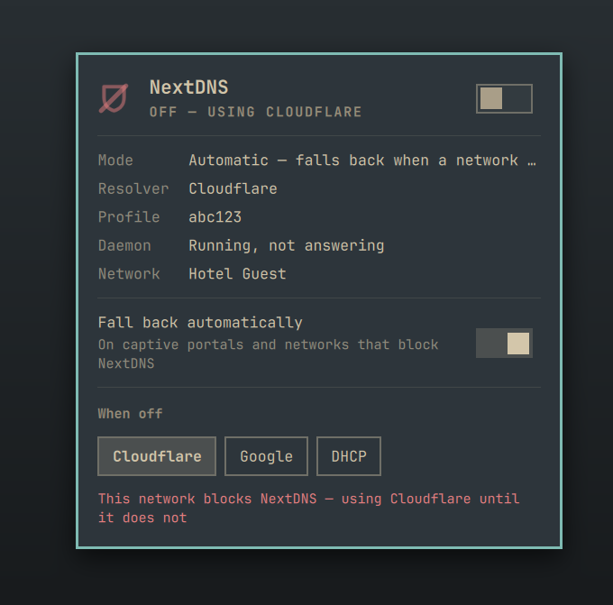
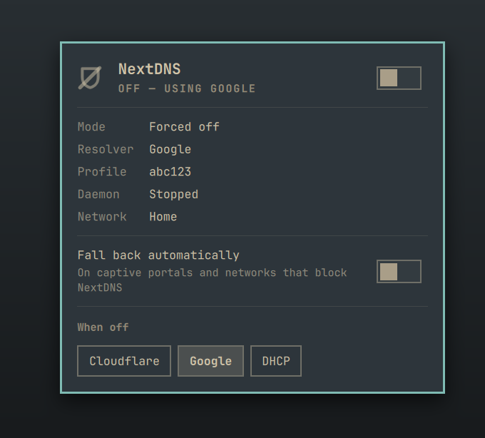

# NextDNS — an Omarchy bar widget

NextDNS that never strands you. Your NextDNS filtering in the bar, with a
fallback that makes hotel and coffee-shop Wi-Fi just work.



## What you get

NextDNS is great until you join a network that blocks it. Then nothing loads,
the Wi-Fi sign-in page never appears, and you're left digging through settings.
This widget handles that for you.

**See at a glance that you're protected.** The shield in the bar shows NextDNS
is filtering. Click it to see your profile, the resolver in use and whether
the NextDNS daemon is actually answering.





**Captive portals just work.** On hotel or guest Wi-Fi that blocks NextDNS, it
steps aside to a resolver the network allows, so the sign-in page can load. The
moment NextDNS is reachable again, it switches back by itself: it checks every
30 seconds, because nothing tells your laptop when you've signed in.



**It fixes a stuck NextDNS.** Sometimes the NextDNS daemon stays running but
stops answering. The widget tells that apart from a network that's blocking it,
and simply restarts it.

**You choose what "off" means.** Turn NextDNS off from the panel, and choose
whether you fall back to Cloudflare, Google or your network's own resolver.



**Plays nicely with Omarchy.** Every change goes through Omarchy's own DNS
command, so the widget and Omarchy's settings always agree about what's in use.

**Honest about what it touches.** A small, readable installer sets up the
parts that need root. It installs everything under this plugin's own names and
records exactly what it installed, so uninstalling hands your DNS back and
removes just that.

Installs as the bar widget `blacksheep.nextdns`.

## What you need

- A NextDNS account and its profile id (the short code on my.nextdns.io).
- The `nextdns` CLI, from the AUR: `yay -S --needed nextdns`.

## Install

The widget is only the UI. Switching the system resolver needs root, so a small
privileged half ships in `system/` and `install.sh` puts it in place. Read it
first: it is short, and every file it installs is listed at the top.

```bash
# 1. The NextDNS CLI
yay -S --needed nextdns

# 2. The widget
omarchy plugin add https://github.com/jonspinks/omarchy-nextdns --enable

# 3. Its privileged half. Asks for your profile id if /etc/nextdns.conf has none.
~/.config/omarchy/plugins/blacksheep.nextdns/install.sh

omarchy restart shell
```

`install.sh --check` reports what is in place and changes nothing.

**Don't use Omarchy's DNS provider picker** (Settings, or the shortcut in the
Wi-Fi panel) while this is installed. It rewrites the resolver settings
wholesale and drops NextDNS. Use the widget's Off and "When off" choices
instead; they go through the same `omarchy-dns` command safely.

## Update

```bash
omarchy plugin update blacksheep.nextdns
~/.config/omarchy/plugins/blacksheep.nextdns/install.sh   # refresh the root-owned copies
```

`install.sh --check` says when an installed script differs from the plugin's.

## Remove

```bash
~/.config/omarchy/plugins/blacksheep.nextdns/install.sh --uninstall
omarchy plugin remove blacksheep.nextdns
omarchy restart shell
```

`--uninstall` moves DNS to the fallback resolver **first**, so nothing is left
pointed at a daemon nobody manages, then removes every file `install.sh` put in
place that is still as it installed it. It leaves `/etc/nextdns.conf`, the NextDNS daemon's own unit and the
`nextdns` package, because those are yours.

## How it works

NextDNS runs as a local DNS-over-HTTPS proxy on `127.0.0.1:53`, and the system
resolver points at it. All resolver changes go through Omarchy's own
`omarchy-dns`, so the widget and Omarchy's settings never disagree about what
is configured.

`90-blacksheep-nextdns`, a NetworkManager dispatcher script, re-evaluates on every
network change, and `blacksheep-nextdns-auto.timer` re-evaluates every 30 s. The timer
exists because **no NetworkManager event fires when you sign in to a captive
portal**: something has to notice you are through and switch back.

`nextdns-apply auto` tells two look-alike failures apart. Both show up as
"127.0.0.1:53 stopped answering":

- **The daemon has wedged**: alive and bound, but it has lost its upstream
  connections and never rebuilds them. The fix is a restart.
- **The network blocks DNS-over-HTTPS**: a captive portal, or a guest network
  that only allows its own resolver. A restart achieves nothing; the fix is to
  step aside to Cloudflare, Google or the network's own resolver until NextDNS
  is reachable again.

Checking whether NextDNS's own endpoint is reachable, by IP so the check never
depends on the resolver it is diagnosing, separates them exactly.

`nextdns-toggle` is the panel's manual override (`toggle`, `on`, `off`, `auto`),
plus which resolver "off" falls back to.

## Privilege model

The bar runs as you. It reads state from world-readable files
(`/var/lib/blacksheep.nextdns/`, `/run/blacksheep.nextdns/last-result`, the resolver
config Omarchy writes, and `/etc/nextdns.conf` for the profile id it shows)
through `scripts/nextdns-stats`, which runs from the plugin folder as a fixed
command.

Everything that needs root goes through one `sudoers` drop-in,
[`system/sudoers.d/99-blacksheep-nextdns`](system/sudoers.d/99-blacksheep-nextdns),
which lists every command with its exact arguments and has **no wildcards**:
`nextdns-toggle toggle|on|off|auto`, and `nextdns-toggle provider` with only
`Cloudflare`, `Google` or `DHCP`, never an arbitrary server.

The scripts it grants are installed root-owned in
`/usr/local/libexec/blacksheep.nextdns`, never run
from the plugin folder, so nothing you can write is ever run as root. They keep
their state and locks in root-owned directories, never in a shared temporary
one. `install.sh` fills in your account name, validates the drop-in with
`visudo -c` in a temporary location and only then moves it into place: a
sudoers file that does not parse locks sudo out entirely.

The drop-in is named `99-` because sudo applies the **last** matching rule, so a
blanket `%wheel ALL=(ALL:ALL) ALL` sorting after it would bring the password
prompt back.

## What it owns

Everything `install.sh` installs is under a name that belongs to this plugin
(`blacksheep.nextdns` / `blacksheep-nextdns`), and it records a SHA-256 of every
file it installs in `/var/lib/blacksheep.nextdns/installed`.

- **Install** replaces a file only if it is absent, is the plugin's own
  recorded copy unchanged, or is already byte-identical to what it would
  install. Anything else stops the install before it changes a thing, and
  names the file.
- **Uninstall** removes only files that still match their record. A file
  changed since install is left in place and reported. Without a record it
  removes nothing: it never guesses from a file name.
- **The NextDNS daemon.** `nextdns.service` is installed only when there is
  none, and an existing one is never replaced, enabled or removed by
  `install.sh`. The widget does **start, stop and restart it**, whoever
  installed it: that is what switching NextDNS on and off, and repairing a
  wedged daemon, means. Install this widget only if it should control your
  NextDNS daemon.
- **`/etc/nextdns.conf`** is written only when absent, and never removed.

## Design notes

- "Active" is read from the file `omarchy-dns` writes
  (`/etc/NetworkManager/conf.d/20-omarchy-dns.conf`), not from the widget's own
  override. The first click after an automatic change has to go the way you
  see, not the way the widget last asked.
- The failure worth catching is a daemon that stays `active` and bound to
  `127.0.0.1:53` while answering nothing, which `systemctl is-active` cannot
  see. The stats script sends one real DNS query to decide.
- The "When off" row is a `Ui/ButtonGroup` with `focusable: false`, so it does
  not swallow the panel's own `h`/`l` and Enter.

## License

MIT — see [LICENSE](LICENSE).
